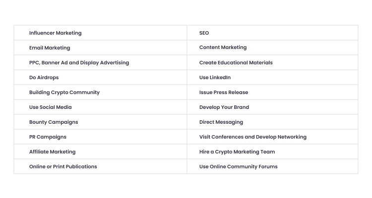
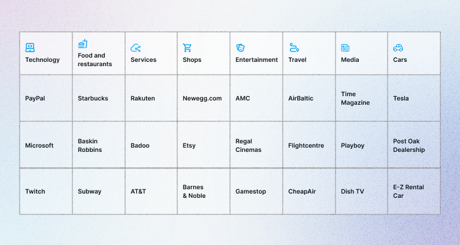

Many new crypto businesses and startups appear every year on the global market. The crypto market itself grows year by year and becomes more competitive. For a business to survive and become successful, it is necessary to have a marketing strategy that helps to build trust and brand awareness and attract more customers. 

If you are in a crypto-related business or a startup, you must build a solid digital marketing strategy to stand out from your competitors. This article will introduce you to 20 crypto marketing strategies that work and tell you how to design a successful crypto marketing strategy for your business.

**20 ways to promote your project** 

Among all marketing strategies to promote a crypto business, we have chosen the 20 most applicable to a crypto business: 

When choosing the right strategy for your business, we would recommend considering the following: 

**1. Think about your aims**

Develop a clear idea of what you want your project to achieve. Consider what money you want to earn and how this project should impact your business. 

Use SMART goals to formulate your aims in detail:

* **S: Specific** 

Example: Grow the number of monthly visitors of the "….." mobile app by creating a growing crypto community on social media and building brand awareness.

* **M: Measurable**

Example: Increase the number of monthly users of the "….." mobile app by 1,000 by optimizing our website and creating targeted social media campaigns for four social media platforms: Facebook, Twitter, Instagram, and LinkedIn.

* **A: Achievable**

Your goals should be realistic. Ask yourself: is your objective something your team can reasonably accomplish?

* **R: Relevant**

Think big. Why have you chosen these goals? 

Example: By increasing the monthly users of the "….." mobile app by 1,000 via social media, we concentrate on trust building and brand awareness. Our users will use our product longer, spread the word and bring better profitability to our business.

* **T: Time** 

What's your time horizon?

Example: Increase the number of monthly users of the "….." mobile app by 1,000 by Q1 of 2023.

**2. Think about a community** 

Because crypto is a new concept, you must develop a dedicated community to promote your project.

It would help if you established a community of targeted buyers before launching your project. Community marketing is challenging and time-consuming. But if you provide your audience with value and get them engaged, it's well worth the effort. 

Some of these methods include:

* Move towards trust 
* Work with a crypto influencer 
* Know your audience (age, preferences, region, language) 
* Try never to lie or mislead your customers
* Be transparent
* Invest time and research to determine what your buyers need and expect
* Encourage satisfied customers to leave good reviews, and work with users who negatively review your brand.

**3. Be aware of crypto policies and regulations**

Crypto still needs to be entirely used around the globe. Some countries and companies have been using it for a while, while others still ban crypto. When choosing a media platform to implement your marketing strategy, check the policies first: 

[Twitter crypto policies ](https://business.twitter.com/en/help/ads-policies/ads-content-policies/financial-services.html)

[YouTube crypto policies ](https://support.google.com/adspolicy/answer/12055790?hl=en)

[Facebook and Instagram rules on crypto ads](https://www.facebook.com/login/?next=https%3A%2F%2Fwww.facebook.com%2Fbusiness%2Fhelp%2F438252513416690)

[Reddit crypto policies](https://www.reddit.com/r/CryptoCurrency/wiki/expanded_rules/)

Now it is time to design an effective crypto marketing strategy. 

**Design an effective crypto marketing strategy**

**Who is your customer?**

Do you know your target audience well? If you are unsure, consider researching to find out more about your audience. 

Create two or three target customer personas and develop a marketing strategy that appeals to them. Then, check if your content, ads, and product keep that ideal customer-focused. 

By answering the following questions, you can create an accurate customer avatar: 

* Demographics: location, age, gender, annual income, and education level 
* Interest: websites, brands they like, and influencers your customer might read or follow 
* Key purchase drivers: what your customer wants from a product? 
* Fear and frustration: the problems your customer may face
* Wants and aspirations: what will change in your customer's life if they use your product? 

**Customer avatar**

**Who are your competitors?**

Check what companies provide the same service as you do and identify the gaps in their work. Then offer a solution that promises to attract the audience. 

What to look for: 

* Study competitors' websites to understand their current solutions and features
* Read their blogs and social media to analyze what content they post. Check online reviews posted by customers on social channels.

Competitor analysis gives you valuable insights about businesses in your niche, products, customers, and competitors' popular technologies.

**What is your plan?**

Discuss with your team how often you would like to post your content and what channels you would use for that. A marketing calendar is a great way to plan your marketing communication via different channels. 

**How will you track the performance?** 

Monitoring your strategies' key metrics will help you analyze if you're on the right track or need some change. There are different performance indicators for each strategy that you should use when checking the statistics. 

For example, for email marketing, the key indicators will be open rate (how many people open the email), click rate (who clicked on the call-to-action button), conversion rate, and, most importantly, unsubscribe rate. 

Takeaways:

* Plan a long-term crypto marketing strategy and fill it with effective tactics
* Use a data-driven approach and fact-checking in your marketing communications to remain a trusted source among your audience
* Concentrate on developing trust 
* Use SMART goals when developing your marketing plan
* Know your target audience well