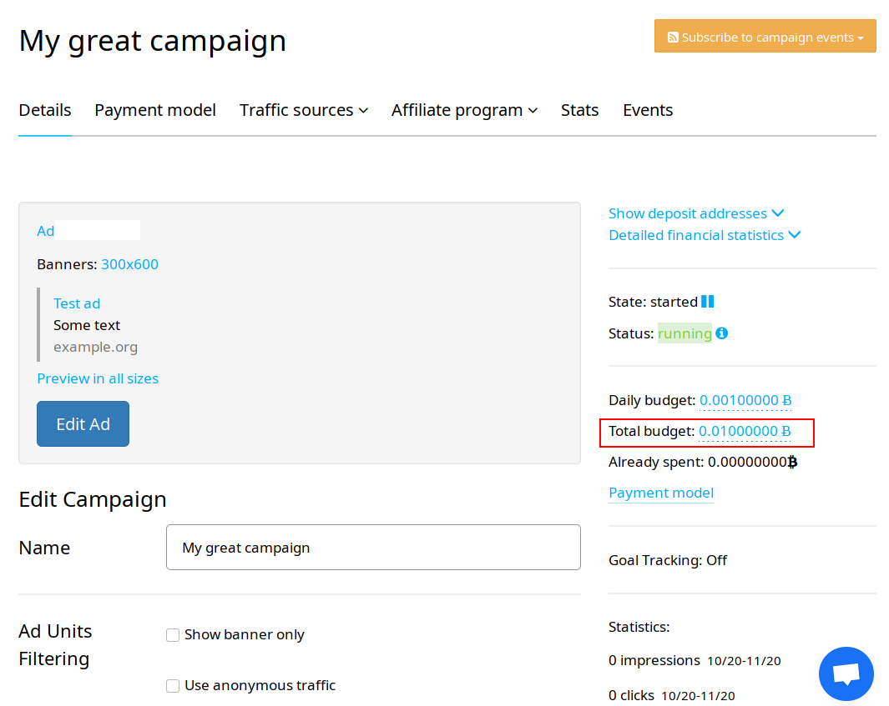

As you probably know, our default payment model is [CPD](https://a-ads.com/blog/2020-07-01-campaign-types/) (cost per day), and running CPD campaigns get automatically refilled from user balance.

To give our users more control over this process, we have added a new parameter for CPD campaigns — Total budget.

"Total budget" is a limit of how much money the campaign can spend.

If the limit is specified, the total amount of funds spent by the campaign will not exceed it.

Let's say you want to spend a total budget of 1 BTC in 10 days. In this case, you need to set the "Daily budget" to 1 BTC / 10 days = 0.1 BTC or more, and the "Total budget" to 1 BTC.

When the campaign spends 1 BTC, it will stop. To resume the campaign, you will need to increase the total budget or leave the field empty to disable the limit.
